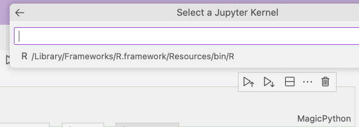

# R setup in VS Code

VS Code is customizable for software development in multiple languages. Here's a note about how to start using it for the R language. 

## 0) Use your current R install

Assume you have a current working R version in the terminal, and 

`> .libPaths()`

returns a valid path:

`[1] "/Library/Frameworks/R.framework/Versions/4.4-arm64/Resources/library"`

On the Mac, VS Code finds the R executable and library paths automatically. You can check this by opening a shell (e.g. zsh, or bash) in VS Code and invoking `R`.

## 1) Integration requires these installs:

* First, in `R` add the [languageserver](https://github.com/microsoft/vscode-languageserver-node) package

`> install.packages("languageserver")`

This package exposes an API for common text editors,  not specific to VS Code 

 * Then install the [_R Extension for Visual Studio Code_](https://github.com/REditorSupport/vscode-R) Extension. (Don't confuse it with "R Tools" or other of the several R related extensions available). It needs to be enabled:


Configuring the Extension is done by the dropdown on the "gear" icon. However the default settings typically work fine. 


Now when you do a "new file" you'll have choice of both an `.R` file and `.rmd` file option. R files include "intellisense" popup suggestions for command completion in addition to other smart editor features. For now try the `.R` file feature; `.rmd` files need additional extensions enabled.  The R Extension also adds an "R terminal" to the list of choices in the lower right terminal dropdown: 


_but you don't need to create an active R terminal to execute R code_, as shown here:

## 3) Running .R files

* The R Extension enables `cmd-return` (Mac) to send the current line or file selection to the R process running in the current terminal window, or creates a process to run it if none exists. Of course you can interact directly with the R process at the prompt in the window. This does not require you to load the languageserver library in the R process. 

* An alternate command is the `Run code` (cntrl-option-n) in the file's right-click context menu, to run the current file via `Rscript.` Be sure to save the file first. 

Since there can be several active R processes, the current process PID is shown on the right in the Status bar. Either method to run code will create a graphics pane if necessary, which can be saved as a png file. 

Other actions are analogous to those familiar in RStudio, but the interface is adapted to VS Code:

In the far left sidebar, the  icon brings up the "Workspace" with a browsable list of global R objects like the Rstudio Environment, and a menu of help page widgets. Similarly a file's right-click context menu "Open help for selection" will bring up the documentation file for an R object. 

## Running Jupyter R notebooks

Conventional Jupyter notebooks can run `R` if they have installed an R kernel that connects them with an installed R interpreter. To set this up, at the `R` prompt install the [IRkernel](https://irkernel.github.io/installation/) package:


```
    install.packages('IRkernel')
    IRkernel::installspec()     # to register the kernel, making it 
                                # visible to Jupyter.
```

Now restart VS Code and from the `New File...` menu item create a Jupyter notebook. To switch to the R kernel, click on the Select Kernel button above the notebook to the right. In the menu-bar  popup, select the R executable, and the "MagicPython" dropdown on the cell will change to `R`. If no `R` kernel is shown, Choose "Select Another Kernel..." to find one. Once youe found one it will appear in the kernel selection menu. 




As with Python, you have a choice with new cells to create either `R` or markdown cells. 

In a notebook, a cell's graphic output will appear below the cell rather than in a separate pane. 

### R <-> python interoperability

### The `rpy2` python module.

To revisit this article's premise, you can work freely between `R` and `python`. There's no need to choose one over the other.  

In Jupyter notebooks, using the python kernel, one can use "R magics" to execute native R code (which actually relies on rpy2). But this is a way to insert R in a native python notebook. If you change a variable value in a cell  in one language it needs to be re-imported to the other language access it there. 

First, configure your python notebook by loading `rpy2` with this cell magic:

`%load_ext rpy2.ipython`

Then import an existing python variable into an `R` cell, say `my_df`, by prefacing the cell with

`%%R -i my_df`

Simlarly to export an `R` variable in an `R` cel so it's visible in python use

`%%R -o my_df`

The analogous single "%" R magic `%R -i my_df` imports from `R` into a python cell. 


Not surprizingly there are no python magic commands in notebooks running an R kernel.  You may notice that cells in VS code python notebooks give you a choice of languages. This is Microsoft's "polyglot" notebook feature, built on top of .NET. Sadly `R` is not a choice. 

### polyglot notebooks

[See](https://code.visualstudio.com/docs/languages/polyglot#:~:text=and%20signature%20help.-,Variable%20Sharing%20and%20Variable%20Explorer,visit%20the%20Variable%20Sharing%20documentation.)

The `rpy2` python package continues to be supported to share dataframes between notebook cells in the two languages. [This blog](https://blog.revolutionanalytics.com/2016/01/pipelining-r-python.html) explains how.


To see documentation on the set of magic commands run `%magic` in a python cell. 

# Quarto: An alternative to multi-lingual notebooks

`Quarto` evolved from R-markdown, as a multi-purpose document generation tool, comprising the best of existing tools. One feature that's an alternative to running R in Jupyter notebooks is the competitive features of quarto's `.qmd` files.  They support blocks in multiple languages embedded in full-featured version of Markdown.  Relevant to this article is their ability to use R and python together, sharing dataframes, using the `reticulate` library. See [this article](https://www.r-bloggers.com/2023/01/combining-r-and-python-with-reticulate-and-quarto/).

<!-- ## 4) And beyond

So you see that editor support provided by the _R Extension for VS Code_ covers most basic features of a useful R GUI. Other features, such as running R markup notebooks, symbolic debugging, or connecting to a browser require loading other VS Code extensions.  -->